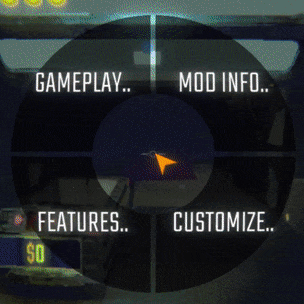

# Radial Quick Message
Radial Quick Message is a quality-of-life mod for R.E.P.O.



## Features

- **Radial Menu UI** – Hold a configurable key (`F` by default) to open a radial menu with customizable messages.
- **Custom Colors** – Fully configurable background and hover colors that auto-reload on change.
- **JSON-Based Configuration** – Customize your radial messages easily via a `.json` file that auto-reloads on change.
- **Send Messages While Walking** – The menu only captures the mouse, movement (`WASD`) remains fully functional, making it ideal for high-stress situations like monster encounters.

## Configuration

The plugin generates a config file with:

- `Open Menu Key`: Key to hold for the radial menu (default: `F`)
- `Menu Color`: Background color of the radial wheel
- `Hover Color`: Highlight color for hovered options

Your message content is stored in a separate JSON file that supports nested categories and dynamic templates like:

```json
[
  {
    "Label": "Reactions..", // Label is what shows in the menu
    "Children": [
      { "Message": "LOL" }, // Message will be put in chat, no label shows message instead
      { "Label": "Haha", "Message": "Haha!" }, // You can have both a label and a message
    ]
  },
  {
    "Label": "HELP..", 
    "Message": "HELP {$}", // {$} will get replaced by the selected child
    "Children": [
      { "Label": "." }, // Label without message here will just result in "HELP "
      { "Message": "kill" }, // "HELP kill"
      {
        "Label": "Carry..",
        "Message": "carry {$} please", // You can nest {$}
        "Children": [
            { "Message": "valuable" }, // "HELP carry valuable please"
            { "Message": "cart" }, //"HELP carry cart please"
        ]
      }
    ]
  }
]
```

This plugin supports templated messages using `{$}` placeholders, which get filled as you navigate deeper into submenus.

## Config Files

- `Jor02.RadialQuickMessage.cfg`: Plugin config (keybinds, colors)
- `Jor02.RadialQuickMessage.content.json`: Your custom radial message tree
